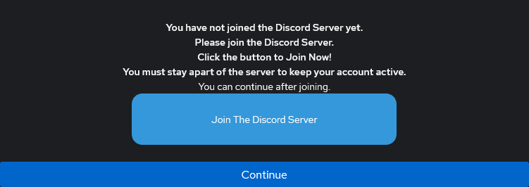

# Discord - OAuth Authentication, Enrollment, & User Group Assignment Setup

### Original Documentation

* [Authentik Docs](https://goauthentik.io/integrations/sources/discord/)

### What this achieves

Adds **Discord** as an Authentik social login source. Authentik checks the user’s Discord membership and role, then either denies access with a message or allows login. On first successful login, Authentik can create the user and assign them to an Authentik group. This also adds the Discord login button to the default Authentik login page.

### Assumptions / prerequisites


* You can access the Authentik Admin UI.
* You already created a Discord OAuth app.
  * You have the **Client ID** and **Client Secret** ready.
* You have Discord **Developer Mode** enabled.
  * You can copy the **Guild (Server) ID** and **Role ID**.
* You’re comfortable creating/editing Authentik flows, stages, and expression policies.


***

### Group Creation

1. **Login to Authentik Admin Panel**
   1. Navigate to `Directory > Groups`
   2. Create a group for `Discord Users`

***

### Deny Stages

#### Standard Deny Stage without Discord Join Message

1. **Navigate to `Flows and Stages > Stages`**
2. **Create a new stage**
3. **Select Deny Stage**
   1. Enter your name as `Discord Deny Verification` and enter a message of your choosing.
4. **Select `Finish` to save**
5. **Go to** [#authentication-flow-creation](discord.md#authentication-flow-creation "mention")

***

#### Deny Stage with Join Discord Join Server Message

For Easier Setup, Create the `Authentication Flow` and the `Discord Expression Policy` in the next step, then come back to this step.

1. **Login to you Authentik Admin Panel**
2. **Navigate to `Flows and Stages > Prompts`**
   1. Create a new Prompt
   2. Put what you want in the `Name`, `Field Key` and `Label` boxes.
   3. Select the Prompt Type as `Static: Static Value, Displayed as-is`
   4. Scroll down to `Help Text`
   5. Insert the following (Change what is needed):



1. **Navigate to `Flows and Stages > Stages`**
2. **Create a New Prompt Stage**
   1. Name the Prompt whatever you want
   2. Under `Fields` in the right column, if there is anything in it, remove everything except for the `Prompt` we just created. If the newly created `Prompt` is not selected, select it and move it to the right column.
   3. Under `Validation Policies`, Do the same thing and remove everything from the right column except for the `Discord Verification Policy` created in the next step.
3. **Navigate to `Flows and Stages > Flows`**
   1. Find your `Discord Authentication` Flow and Click on it
      1. Click on `Stage Bindings`
      2. Bind an Existing Stage and Bind your `Discord Prompt` we just created, change the order to `0` or the lowest number, and click `Create`
      3. Expand the Stage we just added
      4. Click on `Bind Existing Policy / Group / User`
      5. Under `Policy`, select your `Discord Verification` Policy
         * MAKE SURE THE `ENABLED` and `NEGATE RESULTS` are both checked.
         * SET `FAILURE RESULT` to `PASS`

#### Example Picture of Discord Notification



***

### Authentication Flow Creation

1. **Navigate to `Flows and Stages > Flows`**
2. **Create a new flow and name it `Discord Authentication`**
3. **`Designation` is set as `Authentication`**
4. **Click `Finish`**
5. **Click on the new `Discord Authentication` flow and go to `Stage Bindings`**
6. **`Bind an existing stage` and select the `Deny Stage` you just created. `Binding order should be 0`. Click `Finish` to save.**
7. **Click the `Expand arrow` for the `Discord Verification Deny Stage` you just added, click `Create and Bind Policy`.**
8. **Create an `Expression Policy`**
9. **Add the following:**




CHANGE THE FOLLOWING LINES WITHIN THE QUOTES IN THE CODE ABOVE BEFORE SAVING AND CONTINUING:


```py
ACCEPTED_ROLE_ID = "CHANGE TO DISCORD ROLE ID"
ACCEPTED_GUILD_ID = "CHANGE TO DISCORD SERVER ID"
GUILD_NAME_STRING = "CHANGE TO SERVER NAME"
ROLE_NAME_STRING = "CHANGE TO ROLE NAME"
```

1. **Click `Next` to Save the Policy**
2. **Create the binding with `NEGATE RESULT ENABLED` and `FAILURE RESULT` is set to `PASS`.**
3. **Click `Finish` to Save**
4. **Bind a second Existing Stage**
5. **Bind the `default-source-authentication-login`**
6. **Increment your Order to `10`**
7. **Click `Finish` or `Update`**
8. **Go to `Policies` for the same Flow and add `default-source-authentication-if-sso`**

***

### Enrollment Flow Creation


**PLEASE NOTE: THIS ENROLLMENT FLOW STILL DOES NOT WORK HOW I WOULD EXPECT IT TO. UPON FIRST LOGIN ATTEMPT, IT SEEMS TO TOSS A NEW USER BACK TO THE LOGIN PAGE. UPON SECOND LOGIN ATTEMPT, IT SHOULD WORK CORRECTLY. NOT SURE WHY THIS IS, BUT I THINK IT IS SOMETHING WITH AUTHENTIK.**


1. **Create a new Flow and Name it `Discord Enrollment`**
2. **Click on the Flow and click `Stage Bindings`.**
3. **Bind an existing stage and bind `default-source-authentication-login`**
4. **Increment your order to `10`**
5. **Click `Finish` or `Update`**
6. **Expand the newly created `default-source-authentication-login` policy we just binded**
7. **Click on `Bind Existing Policy`**
8. **Add your `Discord Verification Policy`**
9. **Make sure the binding has `NEGATE RESULT ENABLED` and `FAILURE RESULT` is set to `DON'T PASS`.**
10. **Create and Bind a New Stage**
11. **Choose `User Write Stage`**
12. **Name it `Discord Enrollment Writes`**
13. **Check the box next to `Create Users when Required`**
14. **Uncheck `Create new users as inactive`.**
15. **Leave `User Path Template empty` (autofilled later by Authentik)**



1. **Select the group you want users to go into when enrolled**
2. **Increment your order to `20`**
3. **Click `Finish` or `Update`**
4. **Go to the `Policy Section` of the same Flow and add `default-source-enrollment-if-sso`**

***

### Federation & Social Login Creation + Flows Attachment

1. **Navigate to `Directory > Federation & Social Login`**
2. **Create your `Discord Federation & Social Login Provider`**
3. **Under the `Scopes Section`, enter the following:**

```
guilds guilds.members.read
```

1. **At the very bottom of your Federation & Social Login Provider, Expand `Flow Settings`**
2. **Select your Discord flows we just created above for `Authentication` and `Enrollment`**
3. **Under this OAuth Settings Page, I personally also made sure that the `USER MATCHING MODE` is set to `Link to a user with an identical email address. Can have security implications when a source doesn't validate email addresses.` CHANGE TO MATCH YOUR PREFERENCE.**

***

### Add SSO & Flow to Login Page

1. **Navigate to `Flows & Stage > Flows`**
2. **Click on `default-authentication-flow`**
3. **Go to `Stage Bindings`**
4. **Edit stage for `default-authentication-identification`**
5. **Expand `Source Settings` at the bottom**
6. **Select your SSO providers that you setup. Hold CTRL + CLICK for multiple.**

***

### Conclusion

You should now see a **Discord** login option on your Authentik login page. Users who match your Discord verification policy (guild + role) can authenticate, get created on first login (if enabled), and be assigned to your target Authentik group. Users who don’t match should be denied with your configured message.
