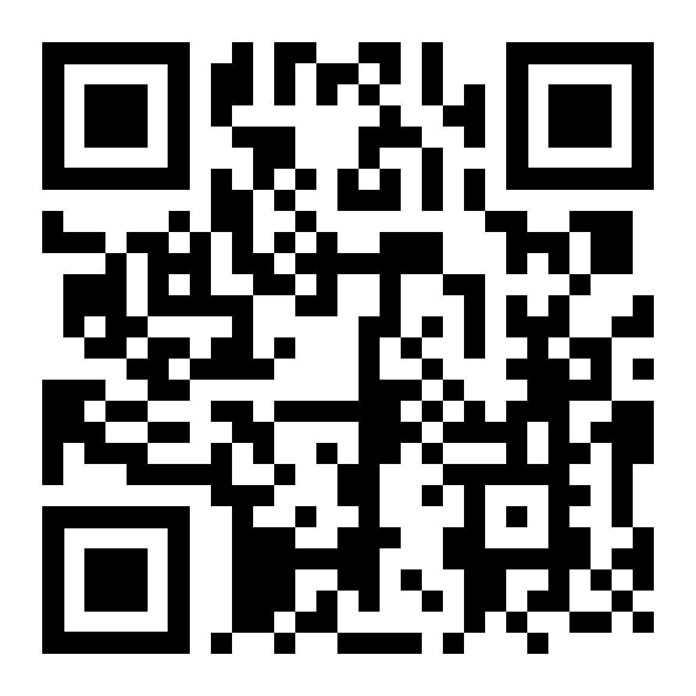

# Donations & Sponsors

## Support my work

If these docs saved you time, consider supporting the project.

Support helps cover hosting, tooling, and time spent improving guides.


Want my N8N automations? They live on Patreon.




{% column width="50%" %}
### Donate


Not sure what to pick? Monthly support helps the most.


#### One-time

* 
* 
* 

#### Monthly

* 
* 


{% column width="50%" %}
### Follow

#### Social

* 
* 
* 
* 
* 

#### Dev platforms

* 
* 



### Bitcoin donations

Use BTCPay for guided donation options.

Use the direct wallet option if you already know what to do.


Crypto transfers are irreversible. Double-check the address before sending.



{% column width="50%" %}
#### BTCPay

* 
* 

Scan this QR code to open the BTCPay donation flow: (Coming Soon)


{% column width="50%" %}
#### Direct Bitcoin wallet

Wallet address:

`34t2s1LhNAWXLdbAJHMNDLhXKfdEyt6fvm`

Scan this QR code to open the wallet address:



